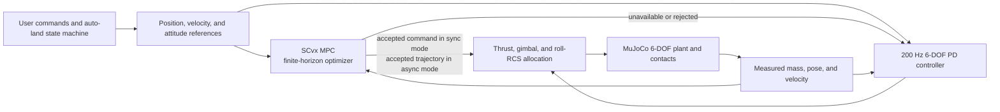

# MuJoCo 3-D rocket landing lab

An interactive rocket-flight and powered-descent simulator designed to run natively on macOS. It includes a full-scale Falcon 9 first-stage silhouette, a temporary upper-stage/fairing stack for launch, manual gimbaled flight, position hold, automatic landing, fuel depletion, landing-leg contact, and live GUI controls.

The MuJoCo vehicle and controller are six-degree-of-freedom. Thrust limits originate with Açıkmeşe, Carson, and Blackmore (2013); hover and landing use a receding-horizon adaptation of the successive-convexification method from Szmuk, Reynolds, and Açıkmeşe (2020).

For a guided sequence of experiments, see [TEACHING_GUIDE.md](TEACHING_GUIDE.md). For equations and paper-to-code mapping, see [METHODS.md](METHODS.md). For the optimizer specification and explicit scope boundaries, see [MPC_DESIGN.md](MPC_DESIGN.md).

## What this project is for

This is a teaching and experimentation project, not a flight-qualified Falcon 9 simulator. It is designed to make several ideas visible in one runnable system:

- why a nonzero minimum-thrust engine creates a hybrid on/off control problem;
- how thrust applied below the center of mass couples translation to pitch and yaw;
- why a single axial engine needs a separate roll actuator;
- how a moving center of mass changes inertia and the engine moment arm;
- how MPC differs from a high-rate PD controller;
- why optimized trajectories must be checked against the nonlinear plant;
- how ballistic coast can save fuel before a landing burn.

The software is easiest to understand as four layers:



The mission/guidance phase (`BOOST`, `ALIGN`, `COAST`, `DESCEND`, or terminal approach) answers “what should the rocket do next?” MPC or PD answers “what bounded actuator command should track that request?” MuJoCo answers “what actually happens?”

## Suggested learning path

1. Start in manual mode and find the approximately 40.9% hover throttle. Notice that the lit engine cannot command anything between zero and 20%.
2. Enable hover, tap WASD, and watch the engine initially counter-gimbal to rotate the tall stage before translating it.
3. Climb to roughly 40 m, start auto-land, and watch `ALIGN → COAST → DESCEND → TERMINAL` along with leg deployment.
4. Try a high-altitude vertical flight and observe the stopping-distance relight gate and energy-based descent corridor.
5. Compare `MPC ACTIVE` and `PD ACTIVE`. An MPC rejection is a checked numerical result, not a loss of control authority.
6. Run with `--async-mpc` and compare smoother rendering against delayed-trajectory rejection.
7. Read [METHODS.md](METHODS.md) for the equations, then [MPC_DESIGN.md](MPC_DESIGN.md) for optimizer-specific choices and acceptance rules.

## What is included

- MuJoCo free rigid body with 3-D position, quaternion attitude, linear/angular velocity, moving center of mass, inertia, and contact.
- Falcon 9 first-stage proportions: approximately 41.2 m tall, 3.66 m diameter, and 18 m deployed leg span.
- Four horizontally deployed grid fins, four folding landing legs, and a nine-engine base whose active 9/3/1 engine cluster is visible throughout the mission.
- Main-engine force applied at the physical engine pivot, producing coupled pitch/yaw torque.
- Full quaternion attitude and heading control with a physical opposed-thruster RCS roll couple.
- Successive-linearization 6-DOF MPC solved as conic subproblems by CVXPY and Clarabel.
- Optional asynchronous MPC trajectory guidance with a deterministic 200 Hz
  thrust, gimbal, and roll inner loop.
- Gimbaled main-engine thrust constrained to a 20-degree mechanical cone.
- Paper-inspired 20–80% throttle interval with a nonzero minimum after ignition.
- Fuel consumption with shared dry-stage/LOX/RP-1 center-of-mass and inertia modeling in MuJoCo and MPC.
- Keyboard and clickable GUI flight controls.
- DPI-aware responsive GUI sizing for Retina, standard-density, and smaller displays.
- Live directional indicators and a thrust slider that follow automatic guidance commands.
- Live per-engine 3-D thrust arrows whose direction follows gimbal and whose length follows thrust magnitude.
- Three-dimensional hover/position hold.
- Automatic pad alignment, descent, touchdown cutoff, and settling.
- Relightable high-altitude ballistic coast with a dynamic landing-burn gate.
- Autonomous full-stack pitch-over, gravity-turn demonstration, stage separation, boost-back, ballistic coast, and first-stage return.
- Automatic landing takeover at 1.05 times the estimated landing-fuel reserve.
- Deterministic 6-DOF PD control when an MPC solve is unavailable or rejected.
- A controller-owner badge that reports launch, coast, MPC, terminal-PD,
  recovery-PD, or manual TVC ownership.

## Requirements

- macOS, Linux, or Windows with desktop OpenGL support.
- Python 3.10 or newer.
- An Intel or Apple Silicon Mac is supported by current MuJoCo wheels.

The project has no CUDA or NVIDIA requirement. CVXPY installs native CPU conic solvers; no external commercial solver is required.

## Setup with `uv`—recommended

Install `uv` on macOS:

```bash
brew install uv
```

From the project directory:

```bash
git clone https://github.com/lzyang2000/rocket_hover_land_sim.git
cd rocket_hover_land_sim
uv sync --extra dev
uv run rocket-landing
```

The `dev` extra installs pytest. If you only want to run the simulator, `uv sync` is sufficient.

The default launcher uses synchronous MPC so every optimized command is based on the current MuJoCo state and current GUI target. It precompiles the conic problem before opening the window, moving the one-time cold-start cost out of the first hover command.

For responsive rendering and input while the optimizer runs in the background, use:

```bash
uv run rocket-landing --async-mpc
```

In asynchronous mode the optimizer supplies a timestamped nonlinear reference trajectory. A deterministic controller runs at every 5 ms MuJoCo step, compensates for solver latency, rejects stale or inconsistent predictions, shifts guidance toward the latest GUI target, and owns the actual bounded thrust, gimbal, and roll commands. Old raw MPC actuator commands are never applied after a delayed solve.

## Setup with a standard virtual environment

```bash
git clone https://github.com/lzyang2000/rocket_hover_land_sim.git
cd rocket_hover_land_sim
python3 -m venv .venv
source .venv/bin/activate
python -m pip install -e '.[dev]'
rocket-landing
```

After the environment has been created, it can also be launched directly from the project root:

```bash
.venv/bin/rocket-landing
```

The custom GLFW viewer renders on the main thread, so macOS does not require MuJoCo's special `mjpython` launcher.

## Important when updating

The simulator process does not hot-reload Python or MJCF changes. Close every existing simulator window before relaunching. The current window title should contain `v0.10.3`.

The initial window is limited to the monitor's usable work area. Control widths, font resolution, and telemetry wrapping are derived from the actual GLFW window and framebuffer sizes, so the right-side labels should remain visible on both Retina and standard-density displays.

## Controls

All keyboard flight controls have clickable equivalents in the right-side GUI.

| Keyboard / GUI | Manual mode | Hover mode | Auto-land |
| --- | --- | --- | --- |
| `I`, Up, or `IGNITE ENGINE` | Ignite | Already controlled | Already controlled |
| Up / Down | Increase/decrease throttle | Move altitude target | Ignored |
| `W` / GUI `W` | Gimbal toward world `+Y` | Move target toward `+Y` | Indicator only |
| `S` / GUI `S` | Gimbal toward world `-Y` | Move target toward `-Y` | Indicator only |
| `A` / GUI `A` | Gimbal toward world `-X` | Move target toward `-X` | Indicator only |
| `D` / GUI `D` | Gimbal toward world `+X` | Move target toward `+X` | Indicator only |
| `H` / `HOVER HOLD` | Capture current position | Disable hold | Cancel guidance to hold |
| `L` / `AUTO LAND` | Begin automatic landing | Begin automatic landing | Cancel to hover |
| `J` / `LAUNCH + RETURN` | Start autonomous launch-return from the pad | Unavailable | Mission active |
| `K` / `KILL ENGINE` | Cut directly to zero | Abort and cut | Abort and cut |
| `R` | Reset vehicle, fuel, and engine | Reset | Reset |
| `Esc` | Close window | Close window | Close window |

### Directional pad

Click and hold a direction button exactly like holding its keyboard key. The buttons illuminate from the current world-direction guidance demand:

- manual input produces the indicator directly;
- hover guidance illuminates the directions used to brake and hold position;
- auto-land illuminates the directions used to align over the pad.

The telemetry line separately reports the actual mechanical gimbal angle and body tilt. During a transient, the engine may briefly counter-steer to create the torque required to rotate the long stage.

The mapping is in fixed world axes, not camera-relative axes. Rotating the camera can therefore make `W` appear sideways on screen.

### Thrust slider

The slider is always drawn on an absolute 0–100% scale. In the landing lab, clicking or dragging commands the nearest valid throttle from 20% to 80%; the unused ends of the bar remain visible so 80% no longer looks like 100%. Moving the slider automatically ignites an engine that is still off. Full-stack Merlin-class modes use their own 57–100% bounds on the same scale.

During hover and auto-land, the slider becomes read-only and changes color to indicate automatic ownership. Its knob follows the throttle actually commanded by guidance, including mass compensation and braking. During ballistic coast it moves to zero and reads `OFF`; the engine remains armed for an automatic relight.

When the engine is off, killed, fuel-depleted, or shut down after landing, the slider returns to its zero position and reads `THRUST 0.0% OFF` rather than retaining the last powered throttle command.

### 3-D thrust arrows

Each active engine receives a colored arrow anchored at its physical bell location. The full-stack ascent therefore shows nine arrows, boost-back and reentry show the center engine plus two opposed outer engines, and terminal landing shows the center arrow alone. The independently moving upper stage receives its own arrow after its engine ignites.

All booster arrows follow the actual lagged gimbal state. Their length and thickness scale with applied throttle, while color moves from orange toward cyan as thrust increases. They disappear immediately when the corresponding engine cluster is off or killed. Each arrow is deliberately drawn outward through the visible plume, so it shows nozzle/exhaust direction; the reaction force applied to the rocket points in the opposite direction.

## Operating modes

### Manual flight

Ignition jumps directly from zero to the required 20% minimum thrust. Hold Up for roughly two seconds to pass the initial Earth hover point of approximately 40.9%. WASD commands a desired world-frame flight direction. A full SO(3) attitude controller allocates that command to the physical engine gimbal and an opposed RCS force pair for roll.

Releasing WASD returns thrust toward vertical but does not remove existing horizontal momentum. Counter-gimbal or enable hover to brake.

### Hover hold

Press `H` or click `HOVER HOLD`. The controller captures the current 3-D position and starts synchronous 6-DOF successive-convexification MPC by default. It predicts mass, position, velocity, quaternion attitude, and angular velocity over a finite horizon, then applies the first bounded thrust/gimbal/roll command before physics advances again.

With `--async-mpc`, SCvx becomes the slower trajectory-guidance layer and the 200 Hz deterministic 6-DOF PD controller becomes the actuator layer. Telemetry reports this as `SCVX MPC ASYNC+INNER`; rejected or unavailable predictions switch immediately to `6-DOF PD` with the rejection reason when available.

In hover mode:

- WASD moves the horizontal target at 3 m/s;
- Up/Down moves the altitude target at 2 m/s;
- releasing the controls leaves the target fixed and the controller settles there.

WASD remains position-target driven: the position error and measured rocket velocity provide the PD/MPC feedback needed to track the moving waypoint. The controller does not falsely label the waypoint itself as travelling at 3 m/s. The horizontal target is limited to a 3.5 m lead and the altitude target to a 2 m lead relative to the rocket; holding a key keeps advancing this bounded “carrot” as the vehicle moves instead of allowing a large error to accumulate. Manual WASD steering also reaches its requested gimbal direction 50% faster. Because the gimbaled engine is below the center of mass, the rocket still briefly counter-gimbals to create the required tilt, but hover MPC commands are limited to 5° of gimbal to suppress swinging. The automatic PD recovery envelope and high-altitude landing limit remain 6°.

Telemetry reports `SCVX MPC SYNC: OPTIMAL` and the latest solve time when the default optimizer owns the vehicle. `SCVX MPC ASYNC` appears when the optional background-worker mode is selected. `6-DOF PD` means the deterministic PD controller owns the vehicle because a solve was unavailable or rejected. `6-DOF TERMINAL` is the intentional low-altitude PD handoff. The right-side ownership badge makes the current state explicit: purple `LAUNCH ACTIVE`, cyan `COAST ACTIVE`, green `MPC ACTIVE`, blue `TERMINAL ACTIVE`, orange `PD ACTIVE`, or gray `MANUAL TVC`.

SCvx virtual control is penalized strongly enough that an optimizer result cannot improve tracking by effectively “teleporting” its linearized state away from the nonlinear rocket. This is especially important after a high-energy coast relight. In the full-throttle fuel-auto regression, accepted MPC ownership rises from zero to about 72% of above-terminal solve attempts while the flight still lands below the 100 kg reserve target. Remaining numerical or defect rejections continue safely under `PD ACTIVE`.

Synchronous mode can pause rendering and input briefly during a solve—typically around 70–150 ms after warm-up on the development Mac—but it avoids applying a command computed from an older rocket state and an older WASD target. Async mode keeps the window smoother at the cost of that command latency.

### Launch and return

Press `J` or click `LAUNCH + RETURN` while the reset rocket is stationary on the pad. The mission runs

```text
9-ENGINE VERTICAL RISE + PITCH PROGRAM → SEPARATION
→ 3-ENGINE BOOST-BACK → BALLISTIC COAST
→ REENTRY/LANDING RELIGHT → 1-ENGINE TERMINAL BURN → COMPLETE
```

The button changes the reset landing vehicle into an approximate full Falcon 9 loadout: 549,054 kg at liftoff, 395,700 kg of first-stage propellant, a 127,754 kg upper-stage/fairing/payload stack, and nine visible Merlin-class engines. The vehicle rises vertically through 1 km, then follows a smooth pitch program that reaches 18° from vertical by 45 km. This creates a visible downrange ballistic arc instead of the previous straight-up trajectory. Guidance still predicts the zero-thrust apogee

\[
h_a=h+\frac{\max(v_z,0)^2}{2g}
\]

and begins separation/boost-back when that prediction reaches 130 km. In the deterministic vacuum regression, separation occurs after about 115.9 s near 52.9 km altitude, 5.1 km downrange, +281 m/s horizontal speed, and +1,230 m/s vertical speed, with about 77.0 tonnes of first-stage propellant remaining.

At separation, the upper stack transfers to its own free MuJoCo body, inherits the launch pose and velocity, and receives a 3 m/s separation push. One second later its modeled 981 kN Merlin Vacuum-class engine ignites. The upper stage carries 92,670 kg of modeled propellant at 348 s specific impulse, loses mass as it burns, and continues powered ascent rather than disappearing or simply falling away.

The booster remains within its first ignition event while three engines perform a 75° retrograde boost-back. It then shuts down and coasts. The mission permits exactly one relight—the second and final ignition—for the combined reentry and landing burn. There are no repeated `COAST`/`DESCEND` relight cycles. In the regression, boost-back ends near 81.0 km with about 63.4 tonnes of propellant, booster apogee is about 145.7 km, and touchdown cutoff occurs after about 488 s with roughly 16.3 tonnes remaining, 0.16 m pad-center error, 0.38 m/s lateral speed, and less than 0.5° tilt.

This is a pitched suborbital teaching mission, not an orbital Falcon 9 trajectory. It still omits atmosphere, max-Q scheduling, drag, wind, entry heating, Earth curvature/rotation, true mission downrange velocity, and a powered second stage.

### Automatic landing

Press `L` or click `AUTO LAND`.

The state machine supplies moving position and velocity references to the 6-DOF MPC. Normal auto-land first climbs or holds at a staging height at least 25 m above the pad. If LAND is clicked during a rapid manual ascent, staging is raised to the predicted minimum-thrust braking apex; this captures the upward trajectory instead of requiring the rocket to overshoot and later return to the obsolete click altitude. ALIGN uses a four-metre horizontal lead through 18 m altitude; above that, the lead grows by 0.15 m per additional metre and is capped at 8 m. The rocket must complete the lateral capture within 2 m, reduce horizontal speed below 1.0 m/s, and settle within 2 m and 1.5 m/s of the staging altitude before descent begins. Alignment is therefore completed high rather than deferred into the final approach. A fuel-reserve takeover normally follows the same logic, but may skip powered ALIGN and coast immediately when the stage is already within 0.75 m of the pad axis, below 0.5 m/s horizontal speed, upright, and dynamically quiet.

If alignment finishes above 32 m while the stage is nearly upright and dynamically quiet, auto-land enters `COAST`: main-engine thrust and fuel flow go to zero, the GUI reports `LAND: COAST`, the thrust slider moves to zero, and the roll RCS remains available. The engine automatically relights at maximum commanded throttle when the current stopping-distance gate is reached. After a long coast, descent follows an energy-based speed corridor rather than immediately braking to the fixed 12 m/s band; this lets a 1,000 m vacuum drop peak near 90 m/s, relight around 590 m, and progressively brake to landing without wasting fuel in a several-hundred-metre powered hover-like descent. Tilt above 5°, angular rate above 0.25 rad/s, lateral error above 2.75 m, or horizontal speed above 1.5 m/s commands an early relight. Low-altitude landings skip coast entirely. `KILL ENGINE` remains a permanent shutdown and is deliberately separate from this armed coast state.

This high-altitude result is a vacuum rigid-body demonstration. Aerodynamic drag, wind, grid-fin authority, and atmospheric attitude stabilization are not yet modeled, so it should not be read as a realistic Falcon 9 entry simulation.

The PD controller can correct modest unmodeled forces after they produce position and velocity error, but PD feedback alone is not enough for a credible wind-and-drag simulation. Atmospheric work should add relative-airspeed aerodynamic forces and moments, wind/disturbance estimation, integral or disturbance-observer action, and dynamic-pressure/angle-of-attack scheduling for grid-fin and engine authority. Robust MPC can then plan with those forces and constraints instead of relying entirely on reactive PD correction.

After relight, guidance uses an aggressive approach with terminal braking:

- 12 m/s above 30 m;
- 8 m/s from 18 to 30 m;
- 5 m/s from 10 to 18 m;
- 3 m/s from 5 to 10 m;
- 1.5 m/s from 2.5 to 5 m;
- 0.6 m/s from 1 to 2.5 m;
- 0.25 m/s inside the final meter.

Crossing a band boundary changes the reference directly to the next nonzero descent speed; guidance does not insert a zero-velocity hold between bands. The altitude reference remains a continuously integrated trajectory, so residual lateral alignment does not reset or jump the vertical target.

Inside the optimizer, a nonzero reference velocity now advances the reference position at every prediction node. This removes the former contradiction that asked the MPC to remain at one fixed altitude while simultaneously tracking a downward velocity. MPC controls hover, alignment, and descent down to 7 m. The deterministic coupled 6-DOF controller then owns the final approach, where its direct feedback is more robust than the short-horizon optimizer under the progressively tight 3°, 1.5°, and 0.75° terminal gimbal limits.

The four landing legs remain folded upward against the fuselage during reset, manual flight, hover, ALIGN, and descent above the 7 m terminal handoff. Entering terminal descent commands a latched 1.25 s deployment down and outward; it continues even if landing guidance is cancelled after deployment begins. The same moving MuJoCo geoms provide the visible legs and their collision contacts, and telemetry reports `LEGS STOWED`, deployment percentage, or `LEGS DEPLOYED`. Reset is the only command that folds them again. An invisible fixed support under the engine section holds the stowed vehicle at startup, then disables permanently at actual liftoff or when auto-land begins.

While the engine is lit outside auto-land, the simulator estimates the propellant needed to land and triggers once fuel reaches `1.05 ×` that estimate. Offset or tilted states retain the conservative powered-alignment model: 2.5 seconds of capture allowance, 10% time/impulse margins, a 250 kg terminal reserve, and a strong lateral controllability floor. An already centered, upright high-altitude state instead uses a direct-coast estimate based on its ballistic apex, predicted ignition speed, powered-burn time, current mass, and only a 50 kg fixed reserve. This prevents the emergency controller from burning tonnes at minimum thrust merely to arrest an otherwise harmless upward coast.

In the full-throttle-from-launch regression, fuel auto now takes over near 5.15 tonnes at roughly 920 m and +144 m/s, coasts immediately, and lands with roughly 70–85 kg remaining depending on MPC ownership; the regression requirement is below 100 kg. A stationary aligned 1,000 m vacuum descent under PD control takes over near 4.0 tonnes and lands with about 45 kg. These are deterministic results for the current simulator, not certified real-vehicle reserves; offset states deliberately trigger earlier.

To prevent low-altitude hunting, the physical gimbal follows commands through an actuator lag and is limited to 3° below 5 m, 1.5° below 2.5 m, and 0.75° in the final meter. Very small terminal commands enter a 0.15° deadband.

The engine normally cuts directly to zero once horizontal error is below 0.50 m, horizontal speed is below 0.30 m/s, vertical speed is between -0.50 and +0.15 m/s, and the rocket is within 15 cm of its landing body height. Fuel-reserve takeover uses an emergency envelope of 1.0 m, 0.60 m/s, and 30 cm so it does not spend its remaining reserve hovering for cosmetic pad precision. The legs and pad friction settle the residual motion.

## Falcon 9-like dimensions and dynamics

Manual flight, hover, and ordinary auto-land use the smaller depleted-booster teaching configuration. `LAUNCH + RETURN` temporarily installs a separate full-stack ascent configuration and returns to the landing configuration on reset. Both use public dimensions and approximate public mass/thrust data; neither claims to reproduce proprietary SpaceX mass properties or flight software.

| Landing-lab parameter | Value |
| --- | ---: |
| Stage height | approximately 41.2 m |
| Tank diameter | 3.66 m |
| Height/diameter ratio | approximately 11.26 |
| Deployed leg span | approximately 17–18 m |
| Nominal engine scale | 720,000 N |
| Allowed throttle | 20–80% |
| Allowed thrust | 144,000–576,000 N |
| Pointing half-angle | 20 degrees |
| Initial wet mass | 30,000 kg |
| Approximate dry mass | 21,000 kg |
| Initial landing propellant | 9,000 kg |
| Dry-stage COM offset | approximately 0.89 m below the initial reference |
| Roll RCS lever arm | 1.75 m per side |
| Maximum force per modeled RCS pod | 5,000 N |
| Maximum roll moment | 17,500 N m |
| RCS response time constant | 0.10 s |
| Gravity | 9.81 m/s² |
| Initial hover throttle | approximately 40.9% |
| Fuel coefficient `alpha` | `5e-4` |

Mass and thrust are both 30 times the original paper-example scale, preserving the same thrust-to-weight ratio while making the vehicle mass more representative of a depleted booster. Initial inertia is matched to the tall stage. As fuel drains, effective LOX and RP-1 liquid columns shorten toward their tank bottoms; MuJoCo and the MPC use the resulting shared COM, inertia, and engine lever arm rather than a uniform inertia-to-mass scale.

| Full-stack launch-return parameter | Value |
| --- | ---: |
| Approximate total height with upper stack | approximately 70 m |
| Liftoff mass | 549,054 kg |
| First-stage dry mass | 25,600 kg |
| First-stage propellant | 395,700 kg |
| Attached upper stack | 127,754 kg |
| Ascent engines | 9 |
| Total sea-level ascent thrust | approximately 7.607 MN |
| Return engines | 3, then 1 |
| Per-engine modeled vacuum thrust | 914 kN |
| Modeled Merlin throttle interval | 57–100% |
| Ascent/return specific impulse | 282 s / 311 s |
| Upper-stage propellant | 92,670 kg |
| Upper-stage thrust / specific impulse | 981 kN / 348 s |
| Cutoff predicted-apogee target | 130 km |
| Maximum ascent pitch | 18° from vertical |
| Boost-back pitch | 75° retrograde from vertical |
| Full-stack ignition budget | 2 total: launch and reentry/landing |

The upper stack is inertially lumped into the launch vehicle until separation. At that event its visible geometry transfers to a second free rigid body with independent velocity, mass depletion, and axial propulsion. The nine- and three-engine forces on the booster are still applied as equivalent centered resultants at the engine section. The per-engine arrows make the selected physical cluster visible, but each arrow shares the cluster's common throttle and gimbal command. This captures total force, fuel flow, mass ratio, separation loss, downrange motion, and gimbal moment-arm coupling, but not individual-engine plume interaction or differential-engine allocation. The full-stack mission uses explicit deterministic energy/stopping-distance guidance rather than the short-horizon landing MPC; the GUI labels this intentional owner as `RETURN ACTIVE`, not as an MPC fallback.

The tank intervals and RCS force level are transparent engineering assumptions, not published Block 5 specifications. A real Falcon 9 combines phase-dependent differential engine gimballing, aerodynamic grid-fin authority, and cold-gas attitude control; this single-engine landing model uses the opposed force pair as the explicit low-authority axial actuator.

The 20–80% throttle interval applies to the landing lab and still comes from the paper-inspired educational model. The full-stack mission instead uses a 57–100% Merlin-class interval. Its reentry/landing ignition remains continuous through touchdown: the vertical law continually recomputes the thrust needed to spend the available stopping distance, switches from three engines to one when one-engine thrust becomes feasible, and never invents a third ignition. A real Falcon 9 still has different engine maps, relight limits, atmosphere, navigation, and mission-specific guidance.

## Is it 6-DOF?

Yes at both the mechanical and feedback-control layers:

- the MuJoCo model has a free joint with three translation and three rotation degrees of freedom;
- attitude is represented by a quaternion;
- angular velocity, fuel-dependent inertia/COM, torque, collision, and landing-leg contact are simulated;
- engine force is applied at the gimbal pivot rather than at the center of mass;
- gimbal force creates physical pitch/yaw moments;
- two opposed forces at physical RCS sites create a bounded zero-net-force roll couple with actuator lag;
- MPC predicts `mass + position + velocity + quaternion + angular velocity`, a 14-state 6-DOF model.

The optimizer is a practical receding-horizon adaptation, not a verbatim reproduction of the paper's full free-final-time problem. It uses numerical dynamics linearization, trust regions, virtual control, conic thrust/gimbal/tilt/rate constraints, warm starts, and repeated replanning.

The precise description is: **a coupled 6-DOF MuJoCo plant controlled by SCvx-inspired 6-DOF MPC, with fuel-dependent mass properties, a physical gimbaled-engine moment arm, and a lagged RCS roll couple.**

## Relationship to the paper

The attached 2013 lossless-convexification paper is an academic soft-landing optimal-control paper, not a publication of Falcon 9 flight software. Lars Blackmore later led landing work at SpaceX, which is why the paper is often discussed in that context. This repository borrows the paper's mathematical constraints and combines them with the later 6-DOF SCvx literature; it does not claim to reproduce SpaceX guidance or vehicle parameters.

Implemented from the 2013 and 2020 papers:

- translational powered-descent dynamics;
- mass depletion proportional to thrust magnitude;
- nonzero lower and upper thrust bounds;
- thrust/gimbal cone;
- quaternion rigid-body dynamics;
- engine-pivot torque coupling;
- repeated dynamics linearization and conic subproblems;
- virtual control for artificial infeasibility;
- scaled trust regions and warm starts;
- receding-horizon application of the first optimized command.

Not yet implemented:

- optimizer-selected free ignition and free final time (auto-land uses an
  explicit stopping-distance ignition gate);
- atmospheric lift/drag and angle-of-attack state-triggered constraints;
- exact first-order-hold discretization matrices;
- formal convergence or global-optimality guarantees.

Read [METHODS.md](METHODS.md) for the derivation and code correspondence.

## Run the tests

With the existing environment:

```bash
.venv/bin/pytest -q
```

Or with `uv`:

```bash
uv run pytest -q
```

## Suggested experiments

Each experiment isolates one control concept:

| Experiment | Procedure | What to observe |
| --- | --- | --- |
| Minimum thrust | Ignite, then reduce throttle fully | Thrust stops at 20% until a discrete coast/kill transition |
| Translation–attitude coupling | Hover and tap one WASD key | Initial counter-gimbal rotates the stage before lateral motion develops |
| MPC validation | Watch `MPC ACTIVE` and `PD ACTIVE` during landing | Optimizer output is used only after nonlinear-defect validation |
| Ballistic landing | Begin a centered landing above 32 m | Fuel flow reaches zero during `COAST`, then relight occurs from stopping distance |
| Launch and return | Press `J` from reset | Predicted apogee triggers cutoff; the same landing controller returns to the origin |
| Fuel emergency | Launch vertically at full throttle and wait | Fuel auto skips wasteful powered alignment and lands with a small deterministic reserve |
| Async latency | Compare default and `--async-mpc` | Async rendering is smoother, but stale or mismatched trajectories are rejected |
| Terminal control | Watch the final 7 m | Control intentionally switches to terminal PD as gimbal authority tightens |

When changing gains or constraints, run the complete test suite and repeat at least the hover, offset landing, high-energy landing, and ground-settling experiments.

## Project layout

```text
.
├── README.md                         setup, controls, and operation
├── METHODS.md                        equations and paper-to-code mapping
├── MPC_DESIGN.md                     MPC specification and acceptance criteria
├── pyproject.toml                    dependencies and command entry point
├── src/rocket_landing/
│   ├── controller.py                 thrust bounds, gimbal cone, and fuel
│   ├── mass_properties.py            dry stage and draining LOX/RP-1 model
│   ├── mpc.py                        14-state SCvx MPC and nonlinear model
│   ├── sim.py                        actuators, PD control, GUI, and rendering
│   └── assets/rocket.xml             vehicle, pad, contacts, and visuals
└── tests/                             physics, guidance, landing, and GUI tests
```

## Troubleshooting

### The window shows an older version

Close all Python/MuJoCo simulator windows and relaunch. Existing processes retain the old code.

### Startup takes a moment before the window appears

The launcher performs one throwaway MPC solve to compile and cache CVXPY's conic problem before creating the window. This takes a few tenths of a second but prevents the one-time canonicalization cost from occurring when hover is first enabled.

### The rocket does not lift

Initial hover is about 40.9%. Hold Up or drag the thrust slider above that point.

### The engine will not restart

After `KILL ENGINE`, restart is intentionally latched out. Press `R` for a new flight. The automatic `COAST` phase is different: it keeps the engine armed and relights without user input.

### Manual WASD appears to move in an unexpected screen direction

Controls use world X/Y axes. The camera can rotate independently.

## Glossary

| Term | Meaning in this project |
| --- | --- |
| Plant | The authoritative MuJoCo rigid-body and contact simulation |
| Guidance | Logic that creates desired position, velocity, and attitude references |
| Controller | Logic that converts references and measured state into actuator commands |
| 6-DOF | Three translational plus three rotational degrees of freedom |
| MPC | Repeated finite-horizon optimization using the current measured state |
| SCvx | Successive convexification: repeatedly linearize nonlinear dynamics and solve convex subproblems |
| PD | Proportional–derivative feedback on position/velocity and attitude/angular rate |
| Virtual control | A numerical feasibility variable inside SCvx; it is not a physical actuator |
| Nonlinear defect | Mismatch between the convex predicted state and an independent nonlinear rollout |
| Warm start | Shift the previous MPC solution forward to initialize the next solve |
| Coast | Zero main-engine thrust with the engine still armed for automatic relight |
| Launch-return | Autonomous pitched ascent, boost-back, ballistic coast, and booster landing near the origin pad |
| Terminal control | Intentional low-altitude PD mode below the 7 m handoff |
| TVC | Thrust-vector control through engine gimballing |

## Follow-up fully coupled 6-DOF literature

- M. Szmuk, U. Eren, and B. Açıkmeşe, [*Successive Convexification for Mars 6-DoF Powered Descent Landing Guidance*](https://doi.org/10.2514/6.2017-1500) (2017).
- M. Szmuk and B. Açıkmeşe, [*Successive Convexification for 6-DoF Mars Rocket Powered Landing with Free-Final-Time*](https://doi.org/10.2514/6.2018-0617) (2018).
- M. Szmuk, T. Reynolds, B. Açıkmeşe, M. Mesbahi, and J. M. Carson, [*Successive Convexification for 6-DoF Powered Descent Guidance with Compound State-Triggered Constraints*](https://doi.org/10.2514/6.2019-0926) (2019).
- M. Szmuk, T. P. Reynolds, and B. Açıkmeşe, [*Successive Convexification for Real-Time Six-Degree-of-Freedom Powered Descent Guidance with State-Triggered Constraints*](https://doi.org/10.2514/1.G004549) (2020).
